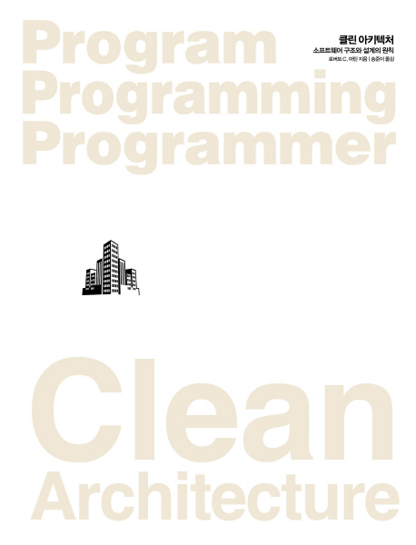

## 도서

  
클린 아키텍처  
`Clean Architecture`  
로버트 C. 마틴 지음

---

## SJ님

클린 코드랑 같이 굉장히 유명한 책. 어쩌다 보니 2번 읽게 되었다.

소프트웨어 아키텍트 관점에서 어떻게 아키텍처를 구성해야 하는가, 무엇을 고려해야 하는가에 다루는 책이다. 사실 아키텍트는 좀 먼 미래긴 한데 굳이 인프라 레벨의 것에 접목시키지 않아도 개발할 때 패키지 구조 짜거나 할 때 고려하거나 적용해볼 만한 내용들이 많이 있었다.

지난번에 읽은 오브젝트도 그렇고, 아무튼 잘 쪼개서 추상화를 하는 것이 견고하고 확장성 있는 프로그램을 만들 수 있다는 것을 다양한 방법과 예시를 통해 전달한다. 이런 류의 책들이 어떻게 보면 좀 뻔한 이야기를 한다고 생각이 들 수 있다. 그런데 그 뻔한 걸 지키면서 개발하는 것이 굉장히 어려운 것 같다. 실제 현업에선 사람, 시간, 환경 등을 포함한 다양한 조건이 다르기 때문에...

책에서 나온 방법들을 모두 지키면서 개발할 수는 없지만, 그렇다 하더라도 의식적으로 적용해보고 피드백하는 것은 개인과 팀의 시야를 넓히고 좋은 습관을 기르게 해 줄 거라고 확신한다. 적용해볼 만한 몇 가지 관점이나 방법들을 건져서 유익했다.
