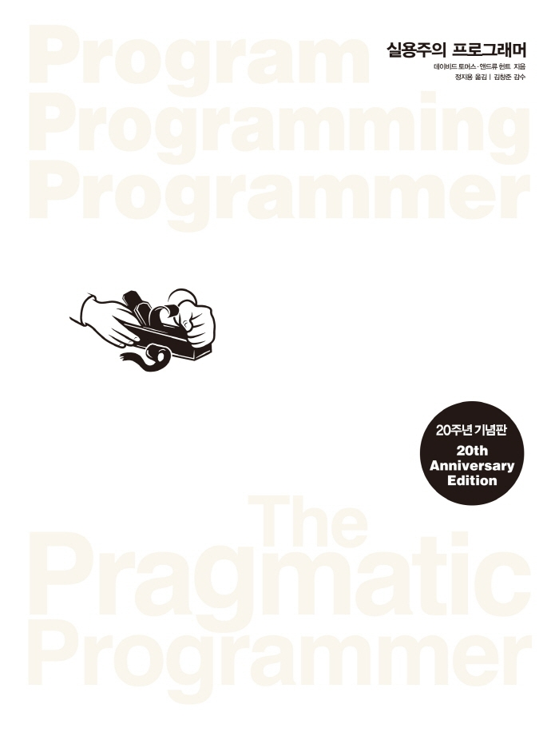

## 도서

  
실용주의 프로그래머(20주년 기념판)  
`Program Programming Programmer`  
데이비드 토머스 , 앤드류 헌트 지음

---

## HS님

> **속성 기반 테스트는 우리를 자주 놀래킨다.**  
> 지금껏 단위테스트만을 사용하여 버그를 최소화하고자 했었는데 속성 기반 테스트의 2가지 장점을 보고나서 단위테스트에서 속성 기반 테스트를 적용해야겠다는 생각을 하게 되었다. 첫째로 여러 가지 다른 수행 결과와 상관없이 문제가 발생하는 상황에 집중할 수 있게 해준다. 둘째로는 단위 테스트가 `회귀 테스트` 역할을 한다.

> **코코넛만으로는 부족하다.**  
> 그저 성공한 기업에서 적용하는 개발 방법, 프레임 워크, 회의 방식을 쫓을게 아니라 내가 속한 팀이 지킬 수 있고 잘 맞는 프로세스가 무엇인지 깊게 고찰할 필요가 있다고 생각했다. 단순히 인기 있는 프로세스를 쫓다가 고착화되면 다른 길을 보기 어렵게 한다. 라는 문장을 통해 지금 하고 있는 회고나 스크럼에 대해서도 고착화 되어가고 있는 것이 아닌지 한 번더 생각하게 만드는 재미있는 토픽이다.

## JS님

> **깨진 창문**  
> QA 상황에서 side-effect를 피하기 위해 workaround를 하다보면 많이 생기는 것 같다. 어떻게 개선할 수 있을까?

> **지식 포트폴리오**  
> 그때그떄 관심가는 것을 막 배우기보다는 현명하게 적절하게 투자를 해야겠다.  
> Rust가 저점인가?

> **DRY 원칙**  
> 기존엔 DRY를 소스 코드 레벨로만 생각했는데, protobuf나 doc comment도 DRY의 일부로 생각할 수 있을 것 같다.

> **IDE 단축키 익히기, 환경설정도 github에 올리기**  
> IDE 사용 시 GUI에 많이 의존하는 편인데, 단축키를 하나씩 배워서 생산성을 높여봐야겠다. 예전에 개발환경을 docker에 말아서 사용하는 분의 이야기를 들은 것이 기억났다.

> **DBC, 헤드라이트 앞서가기**  
> JavaScript -> TypeSciprt 타입 부여도 일종의 계약 추가, 미리 확장성을 고려해도 결국 바꾸게됨.

> **유한상태머신, Observable과 Pub/Sub의 차이점**  
> 프로젝트의 history 제어 라이브러리에 FSM 개념을 적용해볼 수 있지 않을까 생각이 들었다. Observable과 Pub/Sub의 차이점을 알게 되어서 좋았다.

> **상속의 부모 클래스와 자식 클래스의 결합도 증가, 시간적 결합도**  
> 상속이 나쁘다는 이야기만 듣다가, 한 마디에 그 이유가 정리된 것을 들으니 명료하다고 느꼈다. 시간적 결합도라는 개념이 신선했다.

> **액터 모델**  
> nact를 찾아보았는데, 유명하지 않은 라이브러리인데 책에 포함된 것이 신기했다. 동시성으로 인한 이슈로 인한 race condition이 사라지는 것이 인상깊었다. Redux도 actor 모델에 해당하는지 찾아봐야겠다.

> **리팩터링**  
> 탄탄한 회귀 테스트가 없어서 내가 작업하던 코드가 리팩터링이 어려웠던 것이 아닐까? 프로젝트에 탄탄한 테스트가 있어서 수정해도 불안하지 않을 수 있으면 좋겠다.

> **요구사항의 구렁텅이**  
> 스펙문서나 UX 위키가 부족해서 보완을 요청하면서 아쉬움이 들었었는데, 사실은 그런 모호한 요구사항을 구체적인 문제로 푸는 것이 개발자의 역할이라는 것이 인상깊었다. 앞으로는 요구사항 구체화도 내 업무의 중요한 일부라고 생각하고 참여해야겠다.

> **짝 프로그래밍, 애자일**  
> 업무, 사이드 플젝에서 짝 프로그래밍을 했는데, 다음에는 조금 더 키보드 운전수 / 조언자를 확실히 나누어서 해봐야겠다. 회사에서 하는 애자일이 진짜인지 가끔 의문이 든다. 월간 업무를 스프린트라고 구분만 하면 스프린트인걸까? 애자일은 기능조직과 덜 맞는 느낌이다.

> **코코넛 두들기기, 사용자를 기쁘게 하라**  
> 팀에서 하는 애자일 방식들이 과전 애자일의 본질을 쫓고 있는지 의문이 들었다. 개발자의 진정한 직함은 '문제 해결사' 라는 문구가 인상깊고 와닿았다. + Chaos Monkey가 흥미로웠다

## SY님

> **DRY**  
> 동료들끼리 중복 구현을 막기위해 계속 커뮤니케이션을 하는 과정이 필요하다

> **디버깅**  
> 디버깅할 때 당황하다보니 쓸데없는 곳에 시간낭비를 하는 경우가 있는데 이번 장을 통해서 마음가짐을 배울 수 있어서 좋았습니다.

## SJ님

> **시작 피로(start up fatigue)**  
> 한꺼번에 많은 것을 바꾸려면 필연적으로 발생하는 많은 준비 과정이 모두를 지치게 한다.
> 작은 부분을 고르고 그것을 잘 개발하는 것으로 시작해 변화의 촉매가 되어보자.

> **직교성(orthogonality)**  
> 어렵지만 의식적으로 고려해야 하는 개념이라고 생각합니다. 명백하게 다른 layer를 가지고 있다면 각 layer는 서로에게 종속적이 되는 것을 경계해야 합니다.

> **DSL**  
> DSL을 이용하면 특정 문제를 굉장히 직관적으로 풀어낼 수 있습니다. 다만 버그가 없고 완벽한 DSL을 만들 수 있는지, DSL을 만드는데 필요한 자원과 향후 유지보수 관점에서 볼 때 고려해야할 부분이 많습니다.

> **버전 관리**  
> 사용하는 도구의 잠재력을 얼마나 끌어내고 있는지 생각해보게 되었습니다. SVN 등 이전 세대의 VCS를 조금 사용해 본 경험이 있는데요, 최신 개발 환경 아래에서 작업할 수 있는 지금에 감사합니다 :)

> **단정적 프로그래밍**  
> assert를 적극적으로 사용하시는 개발자분이 계셨다. assert문을 사용하지 않고도 안전한 메서드를 작성할 수 있지 않을까라는 생각을 했었는데 유효하지 않은 입력에 대한 전파를 중간에서 막기 위한 방법이라고 생각하니 필요한 부분이라는 생각이 들었다.

> **게시-구독 모델**  
> 구현을 위해 추가적인 도구와 자원이 필요하다는 점을 제외하면 굉장히 특정 상황에서 유용한 방법이다. 팀에서도 이를 적절히 활용해 기존 구조를 개선하려는 작업을 하고 있다.

> **상속세**  
> 오픈소스 코드를 보면 굉장히 상속 계층을 예쁘게 만들어서 관리하고 있다. 다른 관점에서 말하면 굉장히 읽기 어렵다. 실제로 내가 extends, implements 할 수 있는 클래스들이 너무 많다 보니 해당 클래스 구조에 대한 전반적인 이해가 반강제적으로 필요하다. 프레임워크 레벨로 사용하는 오픈소스는 확장성을 위해 어쩔 수 없다고 하지만 2단계 이상의 상속 구조를 특정 상황에 대해 직접 개발해 사용하는 것에는 의문이 든다. (특히 새로 만드는 프로젝트가 아닌 기존 프로젝트의 신규 기능을 개발할 때!)

> **액터 모델**  
> 동시성을 다룰 필요가 없다는 내용이 굉장히 와 닿았다. 책에서 설명하는 것처럼 쉽진 않겠지만, 이 콘셉트대로만 개발이 된다면 정합성을 위해 구현했던 많은 코드를 덜어낼 수 있을 것 같다. 액터 모델과 같은 기능을 구현하기 위해 메시지 큐를 사용하고 있다면(메시지 큐의 사용 용도가 이것만을 위해서라면) 과감하게 전환하는 것도 고려해볼 만하다고 생각한다.

> **TDD: 목표가 어디이지 알아야 한다**  
> 테스트 코드를 작성하다보면 종종 이 테스트의 목적을 잊게 된다. 단순히 커버리지만 올리는 코드는 의미가 없다. 테스트 하고자 하는 게 무엇인지, 내가 작성한 코드가 그것을 테스트하고 있는지 생각하자.

> **이름 짓기**  
> 변수명 고민하는 일은 실제로 필요한 일이다. 좋은 이름 1개가 불필요한 주석 3줄을 없앤다고 생각하고 신중하게 지어보자. 어렵지만 살짝 미래시를 고려해 짓는다면 더 좋다. 실 서비스로 나가게 되면 바꾸기 어렵거나 바꾸지 못할 수도 있다!

> **자신만의 방법에서 빠져나오라**  
> 문제를 해결하는 법은 굉장히 많다. 내가 생각하고 있는 방법이 유일한 방법이라는 생각을 버리자. A를 개선하기 위해 B를 주의 깊게 살펴보고 결과적으로 C를 수정하는 것이 가장 효율적인 선택일 수 있다.

> **버전 관리, 가차 없는 테스트, 전체 자동화**  
> 개발자가 문제를 해결하는데 집중을 하기 위해선 가능한 부분에 대해선 자동화를 해야 한다. 수기로 반복작업하는 것이 정말 없는지 생각해보고, 그것을 자동화 할 수 있는 방법에 대해 찾아보자. 내가 하고 있는 고민은 이미 많은 사람들이 이전에 했던 고민들이고 이를 다양한 오픈소스를 활용해 해결할 수 있을 것이다.

## KY님

> **완벽하게 훌륭한 프로그램을 과도하게 장식하거나 지나칠 정도로 다듬느라 망치지 말라. 완벽할 수는 없다.**  
> 항상 개발을 하면서 완벽한 코드로 개발하고자 하는 욕심에 많은 시간을 장식하거나 리펙토링 하는 과정이 있었는데 이 글을 보며 너무 완벽을 추구하는 것이 오히려 좋지 않을 수 있고, 완벽이라는 것은 없다라는 것이 마음을 편안하게 해주었다.

> **DRY**  
> 동일한 구조를 가진다고 모든 것이 중복이 아니다. 중복이 아닌 우연일 수 있다.

> **버전관리**  
> 버전관리 툴을 현재는 당연하게 잘 사용하고 있지만, 예전에 일하던 곳에서 버전관리를 사용하지 않았던 경험이 있는데 그렇게 협업을 하며 개발을 하지 않는다는 것에 저도 감사합니다.

> **"하지만 그건 절대 일어나지 않을거야."라는 생각이 든다면, 그걸 확인하는 코드를 추가하라.**  
> 개발을 하면서 그런일은 일어나지 않을 꺼야 라는 생각을 하면서 개발하고 그로인해 버그가 발생했던 경험이 있어서 매우 공감하는 이야기였던 것 같다.

## JY님

> **DRY**  
> 기존엔 DRY를 소스 코드 레벨로만 생각했는데, protobuf나 doc comment도 DRY의 일부로 생각할 수 있을 것 같다.

> **리소스 사용의 균형**  
> 서버개발에서는 DB의 connection을 할당하고 해제하는 부분이 리소스를 사용하는 부분이 된다. 리소스 사용을 할 때 주의사항들이 있는데, 라이브러리를 사용해 편하게 처리하고 있어서 잊게 되는 것 같다.

## JH님

> **깨진 창문 이론**  
> 군 복무 시절 인트라넷 유지보수를 하면서 엉망인 코드를 많이 보았다. 다들 이미 엉망이니 대충해도 된다는 마인드를 가졌었고, 코드는 계속 엉망이 되었다. 그래서 망가진 부분을 고치고, 내가 잘 작성하는 것이 얼마나 중요한지 다시금 깨닫게 되었다.

> **가역성**  
> 유연하고 적응 가능한 소프트웨어를 만들어야한다. 변경,추가되는 요구사항에 맞추어 내 코드도 쉽게 변경 가능해야한다.

> **큐컴버**  
> 테스트 코드를 일반인들도 이해할 수 있는 언어로 표현하는 것이 신기하였다

> **고무오리**  
> 누군가에게 이야기하다보면 자연스레 해답을 찾게 되는 경우가 생겨서, 나도 책상위에 브라운 인형을 두고 이야기해봐야겠다는 생각이 들었다

> **게시-구독 모델**  
> JS님 덕에 Observable과 Pub/Sub차이점을 알게 되었다.
> 팀 코드에도 채널을 사용해서 상태값을 업데이트하는 코드가 있는데, 알고보니 Pub/Sub 구조였다.

> **설정**  
> 담당하는 서버에서 외부 설정으로 어플리케이션을 조정할 수 있도록 구현이 되어있어서, 공감이 되는 내용이었다.

> **우연에 맡기는 프로그래밍**  
> 자신도 잘 모르는 코드를 만들지 말라라는 문구가 공감되었다. 모르는 것이 나올 때 스택오버플로우 검색을 해보고 복붙으로 사용하는 경우가 있었는데, 고쳐야겠다

> **철저한 테스트**  
> 커버리지를 100%가 된다고 버그가 없는 코드를 작성할 수 있는 것은 아니다. 의미있는 테스트 코드를 작성하는 것이 중요하다는 시니어분의 말씀이 떠올랐다.
